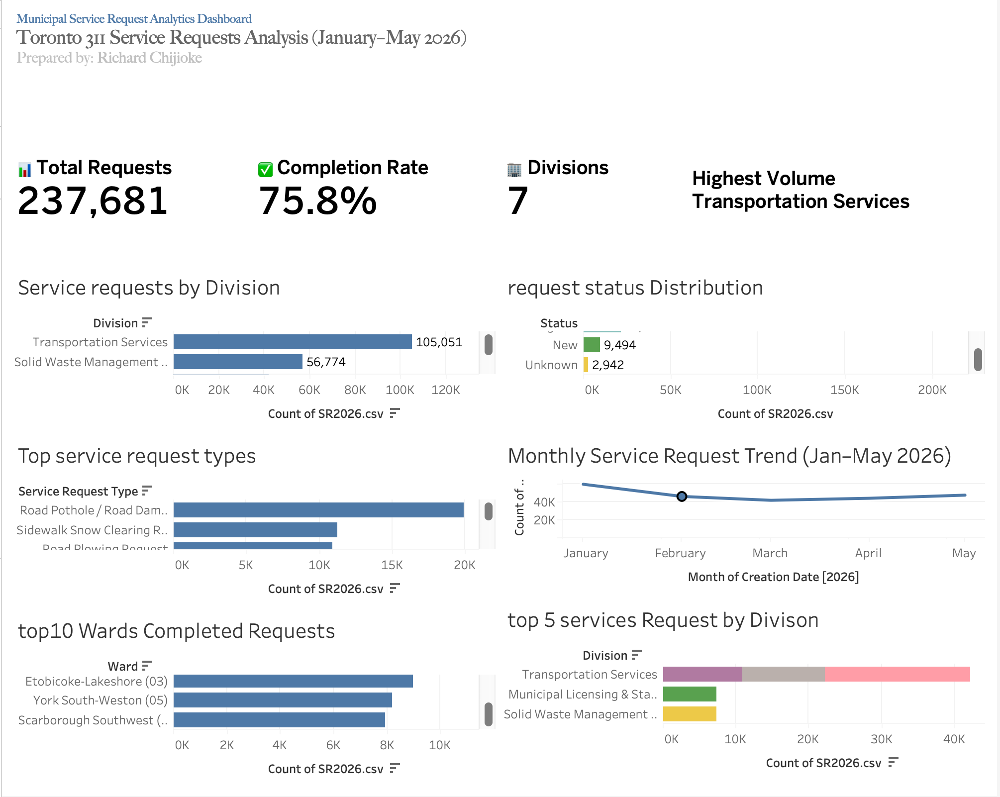
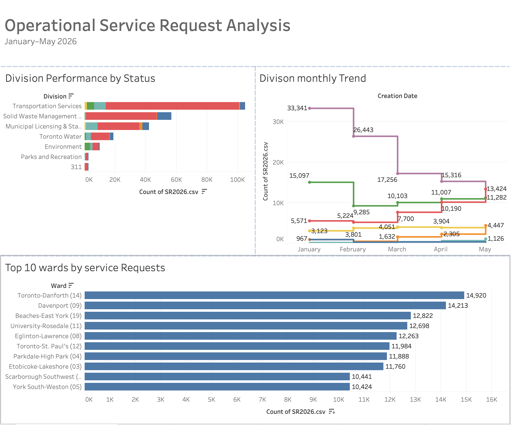
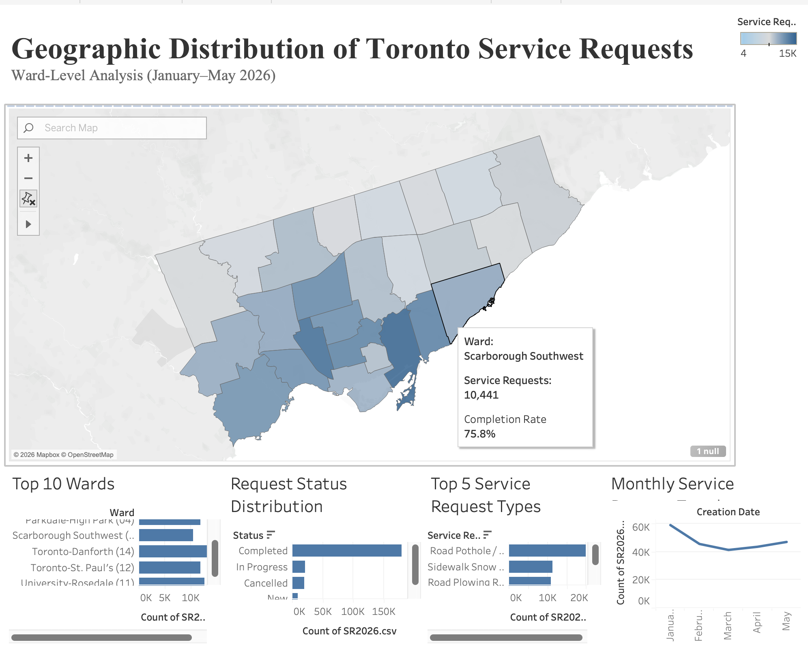

## Repository Structure

```text
Toronto-311-Service-Request-Analytics/
│
├── README.md
├── dashboard_images/
│   ├── dashboard1-overview.png
│   ├── dashboard2-division-performance.png
│   └── dashboard3-geographic-distribution.png
│
├── reports/
│   └── Business_Intelligence_Report.pdf
│
├── tableau/
│   └── Toronto_311_Service_Request_Analytics.twbx
│
├── data/
│   └── dataset_link.txt
│
└── LICENSE (optional)
```
# Toronto 311 Service Request Analytics

Interactive Tableau dashboard analyzing **237,681 Toronto 311 service requests** (January–May 2026) to identify geographic patterns, operational performance, service demand, and completion trends.

---

## Project Overview

Municipal governments receive thousands of service requests every day. Understanding where requests originate, which services are most frequently requested, and how efficiently they are completed helps city managers allocate resources more effectively.

This project uses Tableau to analyze Toronto's 311 service request data and transform raw records into interactive dashboards for operational decision-making.

---

## Business Objectives

- Identify high-demand wards across Toronto.
- Analyze the most frequently requested services.
- Evaluate request completion status.
- Monitor monthly service request trends.
- Visualize geographic demand using ward-level mapping.
- Support evidence-based municipal resource allocation.

---

## Dataset

# Dataset

The original Toronto 311 Service Request dataset exceeds GitHub's file size limit.

This repository includes a representative sample for demonstration purposes.

**Original Dataset Source:**
https://open.toronto.ca/

The full dataset can be downloaded from the City of Toronto Open Data Portal.

---

## Tools & Technologies

- Tableau Desktop
- Spatial Analysis (GeoJSON)
- Data Visualization
- Business Intelligence
- Dashboard Design

---

## Dashboard Preview

### Dashboard 1 – Executive Service Request Overview



---

### Dashboard 2 – Operational Performance by Division



---

### Dashboard 3 – Geographic Service Request Analysis



---

## Key Insights

- Downtown Toronto recorded the highest concentration of service requests.
- Road maintenance and sidewalk-related requests represented the largest service categories.
- Most service requests were completed successfully, indicating strong operational performance.
- Service request volume declined from January through March before increasing again in April and May.
- Geographic analysis highlighted clear differences in service demand across Toronto wards.

---

## Business Recommendations

- Increase staffing in consistently high-demand wards.
- Prioritize frequently requested service categories for proactive maintenance.
- Continue monitoring completion rates to improve operational efficiency.
- Use ward-level trends to guide seasonal resource planning.

---

## Skills Demonstrated

- Tableau Dashboard Development
- Interactive Data Visualization
- Spatial Analytics
- KPI Reporting
- Business Intelligence
- Data Storytelling
- Public Sector Analytics

---

## Author

**Richard Amarachi Chijioke**

Master of Data Science

Mechanical Engineer

Data Analyst | Business Intelligence | Tableau | SQL | Python
